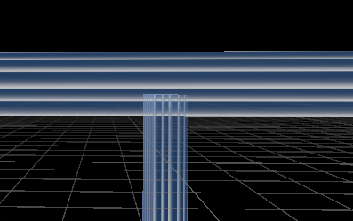
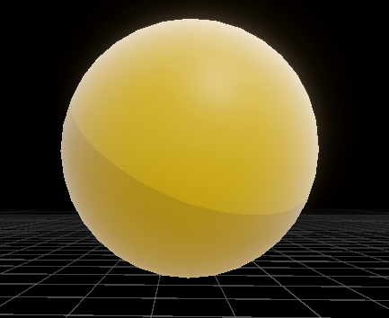
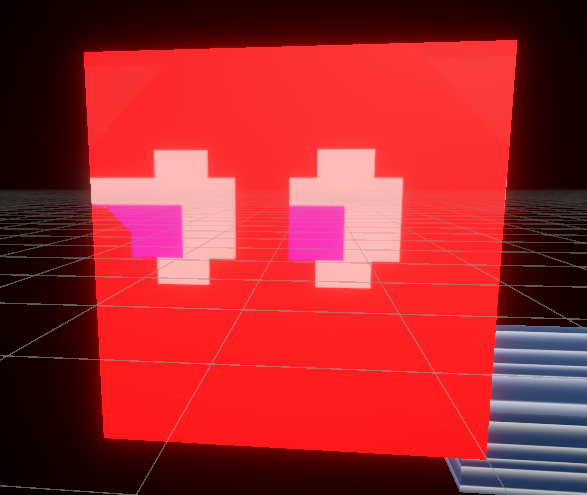
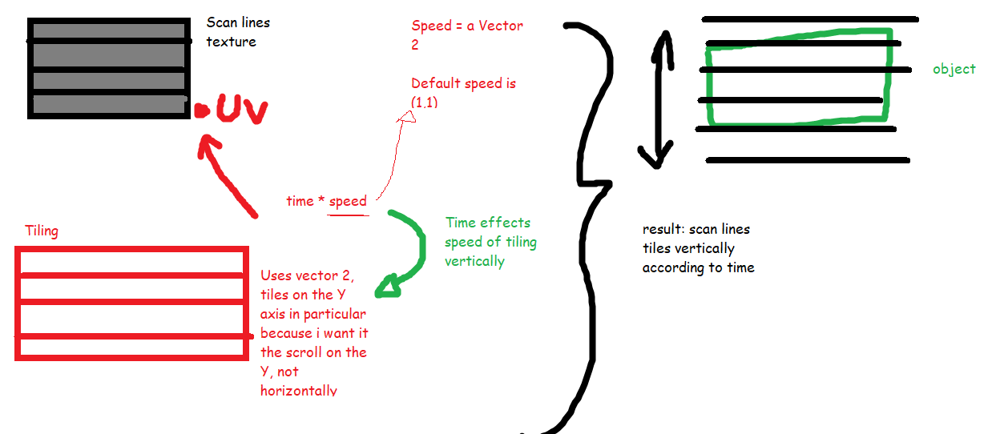

# Kate-Intro-To-CG-Final-Exam
SHADERS:
1. Hologram
The hologram shader is used on distinctly just the walls of the map, giving it a glowing and translucent effect. This is, in many ways, different from the original Pacman walls but similar in some ways too. The original Pacman walls has just a rim lighting highlighting its silhouette but my shader highlights the whole wall with fresnel (rim lighting) and a faint glowiness with a scrolling hologram texture. I changed it to this because the Pacman walls are typically very plain so because it is a wall, I wanted to make it actually stand out visually in the game. I gave it the hologram texture to match the modern glowing-neon aesthetic I wanted to have which relates to the original Pacman game. While it has a hologram texture applied to it, it still serves its function as a wall. I wanted everything in the game to have a "made-up-of-light" aesthetic because the original game is very bright and colourful, so the hologram shader pairs with that objective. 

I made this shader by having my fresnel node multiplied with a colour so I could achieve a bit of outline for the walls. I have my scrolling texture applied by having a time node and speed property determine the offset of my scan lines (which change only on the Y axis). This is all added together with my fresnal nodes which go into the base colour and alpha of my Lit shader. The alpha is there to give a bit of transparency. I also have a glow colour and glowiness property attatched to the emission master stack so it can glow a bit more to achieve that neon effect.

2. Toon
The toon shader is used distinctly for the player: Pacman itself. The reason I did this was so Pacman would stand out amongst all the glowing and bright things in the game by adding the teeniest bit of depth. The toon shader helps make the character stand out the most so it's more of a utility reason but I added the same glowiness and rim-lighting to still keep it in touch with the neon aesthetic. 

This shader works by calculating where the light is and dividing that source by a number so we can get how many shades we want applied on our game object. These shades are then turned into flat colours to give that cartoonish effect by dividing and flooring them. I then give it it's colour by multiplying and then this is all added together with the rim-lighting before being plugged into the base colour master stack. I also added some glowiness too in the emission so its brighter.

3. Emission/Transparency
This shader is used for the enemy sprite. It is a combination of transparency as well because I wanted to make the ghost from a sprite image. While the outcome was not fully there, I had the idea of utilizing a sprite so the black png background would be transparent leaving only the ghost sprite to appear.

I added some glowiness to the shader by utilizing the emission part of the master stack again. The reason I did this for the ghost was because I wanted the ghost to be really bright and glow because it also makes it very distinct from its surroundings. It also has a very distinct appearance in the game which is why I chose to use transparency for the sprite of that particular entity. 
This shader works by setting the surface and image type to transparent and using a ceiling node to round up and values above 0. So because black is represented by 0,0,0 , theoretically anything that is not black, should be visible. This node is plugged into the alpha and base colour of the master stack. Then I add some glowiness to the emission part too, for that trademark lighting effect.

4. Pixel Shader
This shader is applied to the rendering pieline (PC_Renderer) to apply the shader to everything in the scene. So this is applied on top of all existing shaders. The reason I did this was because old games utilized pixel because it was the only graphics they could do at the time, modern games also use pixel graphics a lot for the aesthetic. This pixel shader is meant to make this game more consistent with the arcade theme but still posessing those modern elements I added with the other shaders. So simply, this shader is meant to make everything more consistent and add to the aesthetic of being cartoonish and bright. 
This shader works by getting the screen dimensions and dividing that by a particular number (pixelation) before getting posterized and plugged into the base colour. This is a full screen shader which is different from all the Lit shaders I have been using thus far. 

Diagram for scrolling texture:
